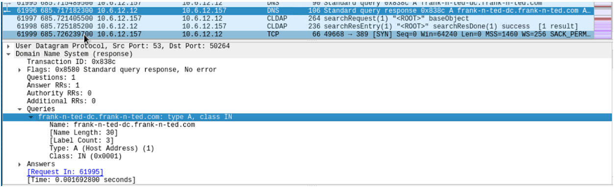
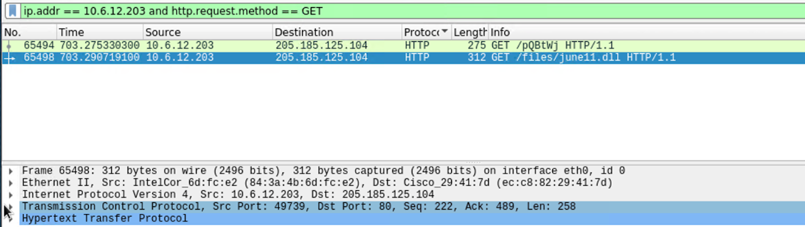
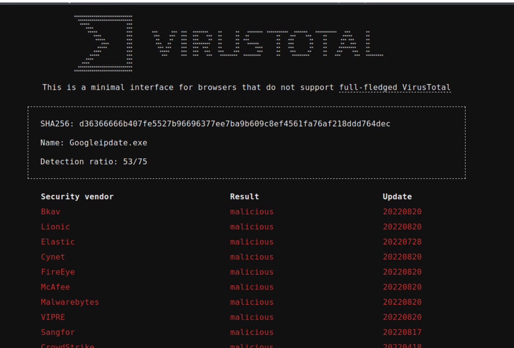
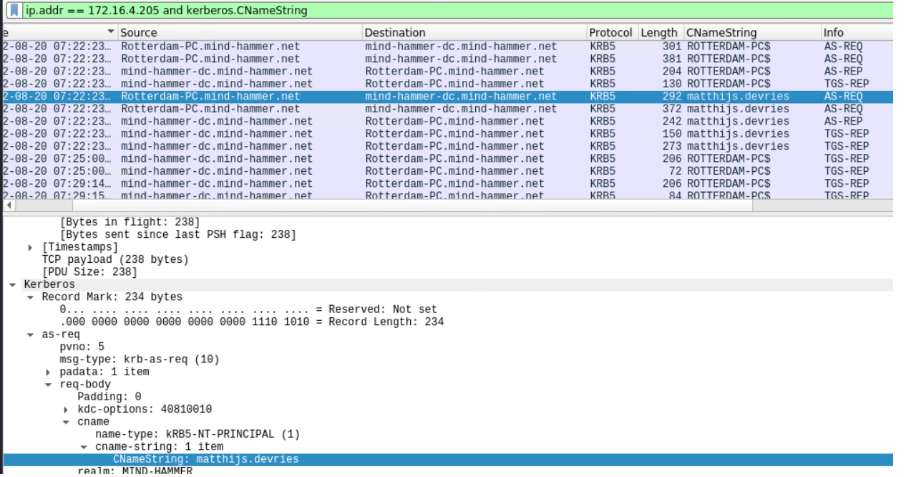
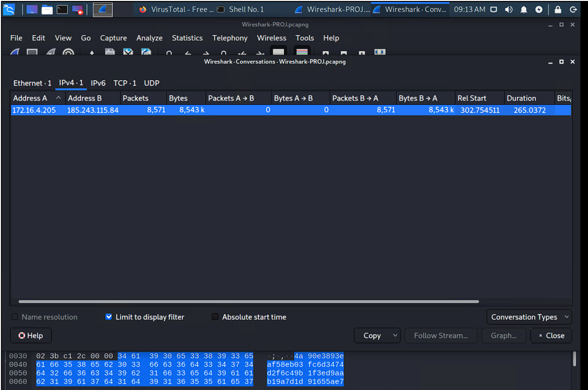

# Network Forensic Analysis Report

_TODO_ Complete this report as you complete the Network Activity on Day 3 of class.

## Time Thieves 
You must inspect your traffic capture to answer the following questions:

1. What is the domain name of the users' custom site?
**Frank-n-Ted-DC.frank-n-ted.com**
(used filter ip.addr == 10.6.12.0/24)

2. What is the IP address of the Domain Controller (DC) of the AD network?
**10.6.12.12**

3. What is the name of the malware downloaded to the 10.6.12.203 machine?
**june11.dll**

4. Upload the file to [VirusTotal.com](https://www.virustotal.com/gui/). 
5. What kind of malware is this classified as?
**Trojan malware virus**
This malware is classified as a Trojan.
It is disguised to like like the common 'googleupdate.exe' but is named 'googleipdate.exe' which is common with Trojan malware.

---

## Vulnerable Windows Machine

1. Find the following information about the infected Windows machine:
    - Host name: **Rotterdam-PC**
    - IP address: **172.16.4.205**
    - MAC address: **00:59:07:b0:63:a4**
    
2. What is the username of the Windows user whose computer is infected?
**matthijs.devries**
(Used filter: ip-src==172.16.4.205 and kerberos.CNameString)

3. What are the IP addresses used in the actual infection traffic?
**185.243.115.84**
172.16.4.205 also experienced heavier traffic than other IP addresses

4. As a bonus, retrieve the desktop background of the Windows host.

